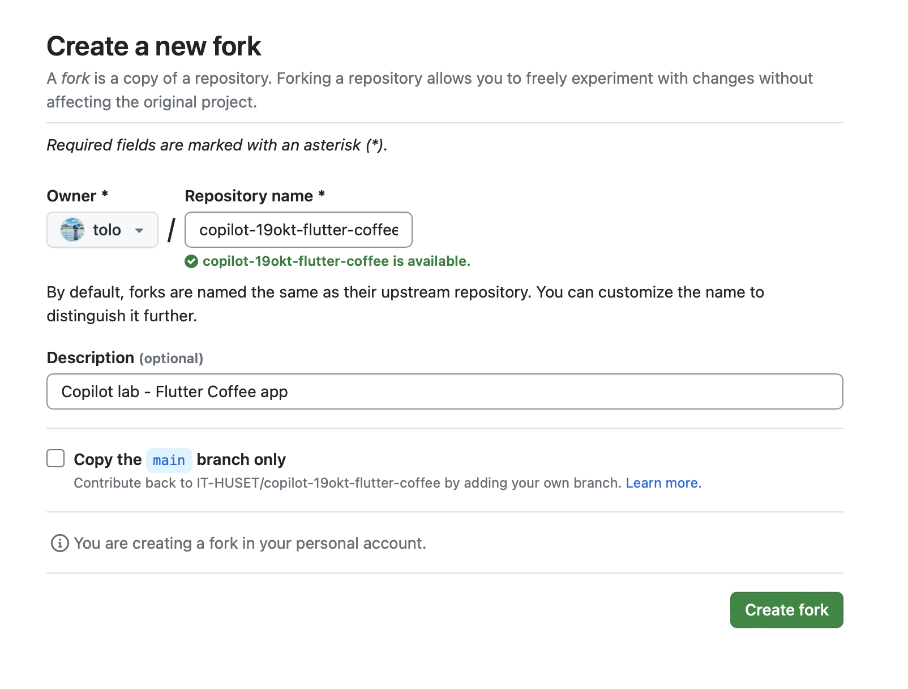
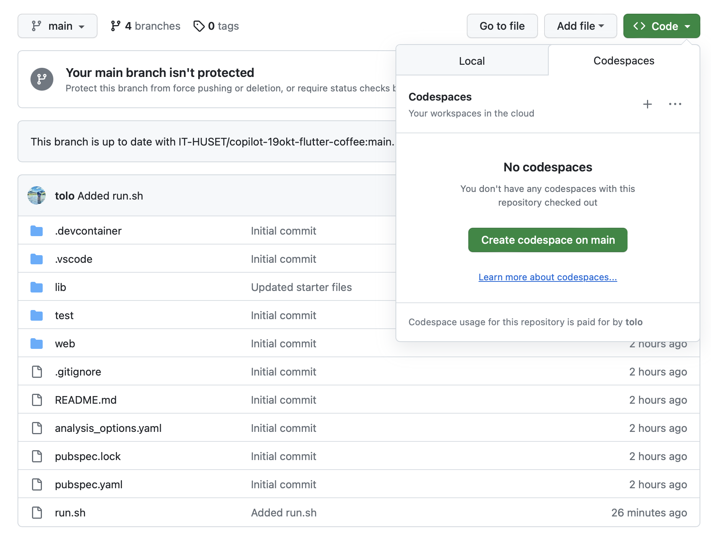

# Kom igång med Copilot Chat (19 okt)


## Sätt upp miljö

* Om du inte redan har det - skaffa dig tillgång till [GitHub Copilot](https://github.com/features/copilot)
* Installera VS Code - https://code.visualstudio.com/Download
* Notera: Vi kommer även använda [GitHub Code Spaces](https://github.com/features/codespaces) för att köra exempel, så det är inte helt nödvändigt att installera VS Code lokalt.
* Installera plugins - se här:
  * https://techcommunity.microsoft.com/t5/educator-developer-blog/step-by-step-how-to-setup-copilot-chat-in-vs-code/ba-p/3849227


## Labb-repon

### För att komma igång med labbprojekten, börja med att "Forka" repona nedan (kryssa ur "Copy main branch only").


### Efter det, skapa upp "Code Spaces" för projekten (tar en liten stund ibland).



#### Simple HTML
[github.com/IT-HUSET/copilot-19okt-simple-html](https://github.com/IT-HUSET/copilot-19okt-simple-html)

#### Flutter Coffee
[github.com/IT-HUSET/copilot-19okt-flutter-coffee](https://github.com/IT-HUSET/copilot-19okt-flutter-coffee)

#### Coffee Backend
[github.com/IT-HUSET/copilot-19okt-backend](https://github.com/IT-HUSET/copilot-19okt-backend)


### Efter installation av Code Space: 
* Installera Copilot plugins
* Installera Live Preview
* (Flutter Coffee) Kör flutter pub get efter att du satt upp ditt code space

<br/>


## Labbuppgifter 
Målet är att prova på de olika funktionerna i Copilot Chat, såom generera kod, fixa problem, förklara kod, generera enhetstester, förenkla kod. 
Tanken är att ni ska **utmana** er själva (och Copilot), genom att använda ett språk/ramverk som ni inte har (så mycket) erfarenhet av innan. 

<br/>

### Simple HTML
Detta projekt använder vi mest för "code along" och testande av olika funktioner i Copilot / Copilot Chat. 

<br/>

### Flutter Coffee - Bygg en Flutter-app för att beställa kaffe

#### 1. Implementera ett enkelt test för att se att första sidan visas
* Använd Copilot för att förklara koden
* Använd Copilot för att hjälpa dig att testa applikationen (uppdatera det icke-fungerande `widget_test.dart`)
* Gör även lite små förfiningar:
  * Centrera alla knappar
  * Ta bort debug-bannern


#### 2. Lägg till stöd för att läsa drycker från JSON
* Skapa en klass som representerar en dryck
* Läs en lista av objekt från JSON-strängen i `coffee_drink.dart`.
* Skapa ett enhetstest för att testa att uppläsningen fungerar.

#### 3. Uppdatera ProductSelection till att avända dryck-listan 
* Be Copilot att ändra ProductSelection så att den visar en lista av drycker
* När man trycker på en dryck ska man gå till nästa skärm

#### 4. Hämta drycker från backend 
* Uppdatera ProductSelection till att göra ett HTTP-anrop till Coffee Backend och använda resultatet därifrån.


<br/>

### Coffee Backend - Bygg en backend till Flutter Coffee

#### 1. Implementera stöd för endpointen /coffeedrinks
 * Returnera en JSON-lista av kaffedrycker:
   ```json
   [
    {
        "id": "1",
        "name": "Icelandic FrostBreeeew",
        "price": "600 ISK",
        "iconURL": "https://prototyingstorage.blob.core.windows.net/files/1508732927_icon_capuccino.png"
    }
   ]
   ```
#### 2. Slå på CORS-stöd

#### 3. Bygg en enkel orderhantering
 * Lagra nya ordrar
 * Implementera en endpoint för att lista ordrar

<br/>


## Bonusuppgifter (på egen hand)

### Scott and Mark learn to code (Asteroids)
https://github.com/shanselman/AsteroidsGame

### Using GitHub Copilot to quickly build a Node.js application with Azure Cosmos DB and App Service
https://moaw.dev/workshop/?src=gh:azure-samples/copilot-nodejs-todo/main/docs/


<br/>


## Hjälp / referens

* [Quickstart for GitHub Copilot](https://docs.github.com/en/copilot/quickstart)
* [Using GitHub Copilot Chat](https://docs.github.com/en/copilot/github-copilot-chat/using-github-copilot-chat?tool=vscode)
* 


